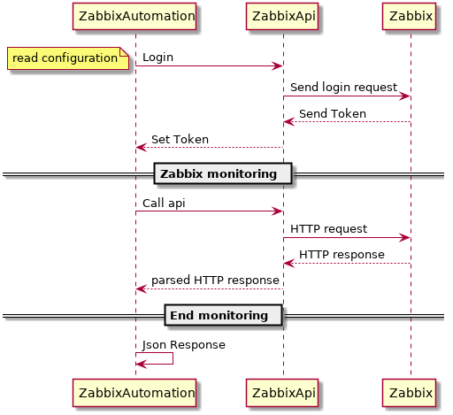
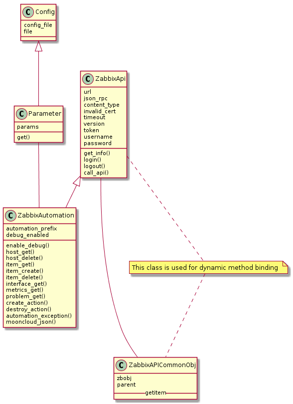

## Synopsis

Mooncloud Zabbix is a tool that using Zabbix API allow to create items and retrieve data.
It also supports:

 * listing hosts
 * add/delete/list items
 * checking for problems
 * add and remove custom alert script
 * get and format data for TSDB.
 
This project also contains a small class for reading basic parameters from a json file.
## What is Zabbix
Zabbix is an enterprise-class open source distributed monitoring solution
### Definitions
#### Host
a networked device that you want to monitor, with IP/DNS
#### Item
a particular piece of data that you want to receive off of a host, a metric of data.
#### Trigger
a logical expression that defines a problem threshold and is used to “evaluate” data received in items
#### Event
a single occurrence of something that deserves attention such as a trigger changing state or a discovery/agent auto-registration taking place
#### Problem
a trigger that is in “Problem” state
#### Action
a predefined means of reacting to an event
#### Zabbix server
a central process of Zabbix software that performs monitoring, interacts with Zabbix proxies and agents, calculates triggers, sends notifications; a central repository of data
#### Zabbix agent
a process deployed on monitoring targets to actively monitor local resources and applications

__Taken from Zabbix Doc__

## Use 
### Tested on python 2.7 ###

launch ``` run.py ```

use ``` -h ``` for help

You can launch the script with the option -c myconfigfile.json to override the default location of the configuation file 

examples

``` ./run.py -c myconfig.json -l
    ./run.py -c config.json -m -i 10254
    ./run.py -c ../../myconfig.json -l --extend
    ./run.py -c ../../myconfig.json -t -i 10254 --extend
    ./run.py -c ../../myconfig.json --addalert
 ```

## Installation
  
 ```bash
 cd mooncloud_zabbix/
 virtualenv2 mooncloud_zabbix/
 cd mooncloud_zabbix/
 source bin/activate
 pip install -r requirements.txt 
 cd mooncloud_zabbix/
 python2.7 run.py 
```
also check the configuration file config.json
## Additional steps

To test notification service you need to:
* put ``` moonalert.sh ``` under the alert script folder in ZabbixServer ```/usr/lib/zabbix/alertscripts/```
and make it executable ``` chmod +x moonalert.sh```

* launch the run.py script with the option ```--addalert```, this option will perform all necessary steps to create
an action that will send a notification every time a problem arise.

You can also remove the action with the cmdline argument ```--delalert```

* At the end to test the notification script you can run ``` notification_receiver.py```
which is a simple http server that listen for HTTP POSTs on port 8000

``` notification_receiver.py [custom port] ```

#### Notice
The default action template which configure the alert message is ``` notification_alert.json```
and its path must be specified in the global configuration file.

```
"notification_script": "alert_script.sh",
"action_template": "../notification_action.json",
"notification_endpoint": "192.168.0.1:8080"
```

## The configuration file
It has 3 main sections:
* zabbix_credentials
* zabbix_api_settings
* zabbix_items

###### zabbix_credentials
the basic information to access Zabbix API

###### zabbix_api_settings
custom API parameters such as https certificate validation, timeout and alert script settings

###### zabbix_items
each time you want to add a check to a host or at every hosts you need to define it as dictionary here
with a proper name and configuration and them apply it with the command
``` run.py -c myconfig.json --additem [-i hostid]```
## Workflow




## Class Schema




